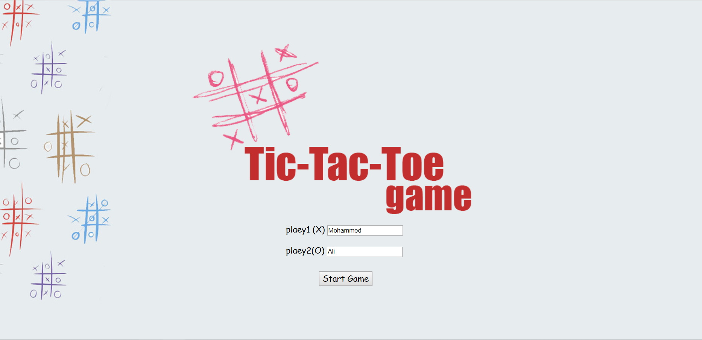
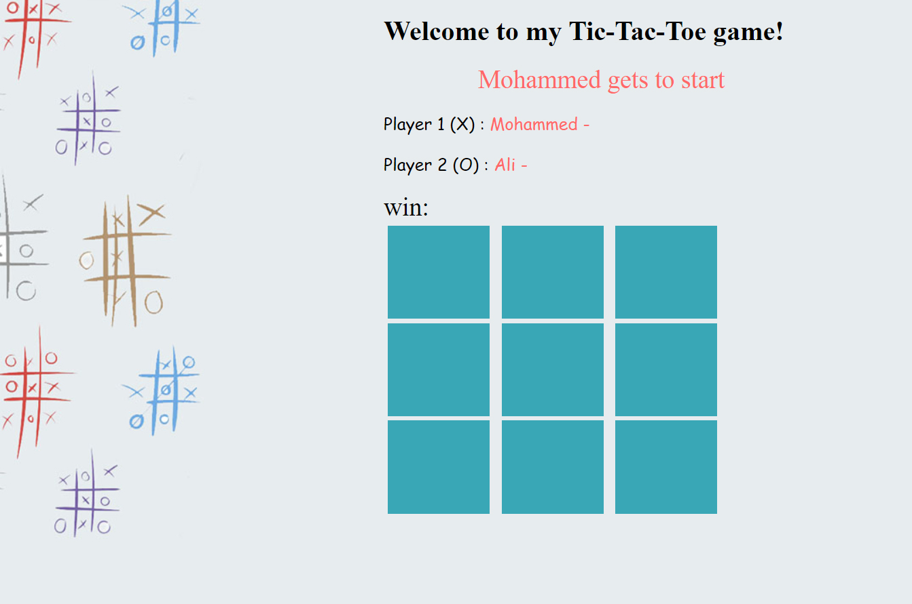
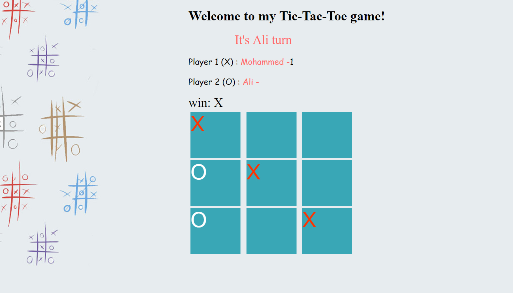

# Project1 : Tic-Tac-Toe game.
Welcome to the TicTacToe Game , a simple Javascript web application

# Technologies used:
HTML
using HTML to create tags such as buttons,textField,image and ...ect ! 
CSS :
I used CSS to design tags that are in HTML. CSS provides incredible design.
Javascript

Javascript: 
I used Javascript It operates the game and determine who is the winner. I used codes in Javascript as follows ( for loop, array ,if statement ..etc)

# Overview : 
two players, X and O, who take turns marking the spaces in a 3×3 grid. The player who succeeded in placing three of their marks in a horizontal, vertical, or diagonal row wins the game

# How to play
Human versus Human:
You just need to type your name and name your friend and press the button and start playing

### Homepage

### Game

### Game

Experience the game here : https://mohammedalghamdi3.github.io/tic2/mohammed/frist.html
